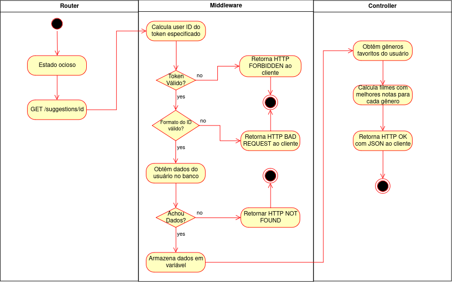

# CaixaDeLetrasBack

## Membros e papéis:

* Ramiro Noronha (Front-End)

* Lucas Almeida (Fullstack)

* Vinicius Faria (Back-End)

* Luiz Rocha (Back-End)

## Escopo e funcionalidades:

O Caixa de Letras é uma plataforma vibrante para amantes de cinema se conectarem, compartilharem suas paixões e explorarem o mundo dos filmes.

* Crie seu perfil: Personalize seu espaço com foto, biografia e seus filmes favoritos.

* Descubra filmes: Encontre filmes por título, gênero, ano e muito mais.

* Avalie e comente: Compartilhe sua opinião sobre os filmes que assistiu, escreva críticas completas e leia o que outros pensam.

* Histórico de avaliações: Veja suas últimas avaliações em uma aba personalizada no aplicativo.

* Conecte-se com a comunidade: Siga pessoas com gostos semelhantes, participe de debates e construa sua rede.

* Fique por dentro: Acompanhe as últimas avaliações dos seus amigos, comentários e novas atividades no seu feed personalizado.

* Modo noturno: Relaxe os olhos com o modo noturno, perfeito para noites de cinema em casa.

* Avalie outros usuários: Reconheça e incentive a participação da comunidade, avaliando seus amigos e colegas cinéfilos.

* Encontre filmes incríveis: Descubra filmes que você vai amar com base em suas preferências e nas avaliações da comunidade.

* Compartilhe sua paixão: Conecte-se com outros amantes de cinema, expresse suas opiniões e participe de debates animados.

* Construa sua reputação: Ganhe reconhecimento por suas avaliações e contribuições, tornando-se um membro influente da comunidade.

## Tecnologias:

* Flutter

* Dart

* Node.js

* Typescript

* Express.js

* MongoDB

## Backlog do Produto

1. Como usuário, quero ter a capacidade de criar e personalizar meu perfil para compartilhar minha identidade dentro da plataforma, incluindo a adição de uma foto, biografia e lista dos meus filmes favoritos.

2. Como usuário, quero ser capaz de descobrir filmes fazendo buscas através do seu nome, para encontrar facilmente o conteúdo que desejo assistir.

3. Como usuário, quero poder avaliar e comentar sobre os filmes que assisti, fornecendo minha opinião e críticas completas, e também ter acesso às avaliações de outros usuários para tomar decisões informadas sobre o que assistir em seguida.

4. Como usuário, quero poder visualizar facilmente meu histórico de avaliações em uma aba personalizada no aplicativo, para acompanhar os filmes que já assisti e minhas opiniões sobre eles.

5. Como usuário, quero poder me conectar com outros membros da comunidade, seguindo pessoas com gostos semelhantes, participando de debates e expandindo minha rede dentro da plataforma.

6. Como usuário, quero ser informado sobre as últimas avaliações, comentários e atividades dos meus amigos por meio de um feed personalizado, para me manter atualizado sobre o que está acontecendo na comunidade.

7. Como usuário, quero ter a opção de ativar o modo noturno para reduzir a tensão nos olhos durante a navegação, especialmente durante as sessões de cinema em casa à noite.

8. Como usuário, quero poder avaliar outros usuários da comunidade para reconhecer suas contribuições e participação ativa, ajudando a fortalecer o ambiente colaborativo da plataforma.

9. Como usuário, quero receber recomendações personalizadas de filmes com base nas minhas preferências e nas avaliações da comunidade, para descobrir novos conteúdos que possam me interessar.

10. Como usuário, quero compartilhar minha paixão pelo cinema, expressar minhas opiniões e participar de debates animados com outros amantes de filmes na plataforma.

11. Como usuário, quero poder construir minha reputação na comunidade, recebendo reconhecimento por minhas avaliações e contribuições, e tornar-me um membro influente dentro da plataforma de filmes.

## Backlog da Sprint

### História 1:

Task: Criar endpoint para o perfil público. (Vinicius)

Task: Alterar usuário no BD para aceitar lista de 4 filmes favoritos, foto e biografia. (Vinicius)

Task: Criar tela de perfil. (Lucas)

Task: Criar tela de login. (Ramiro)

Task: Criar tela de cadastro. (Ramiro)

Task: Criar endpoints para login. (Lucas)

Task: Criar endpoints para cadastro. (Vinicius)

Task: Criar banco de dados. (Vinicius)

Task: Criar tabela de usuário. (Luiz)

Task: Instalar e configurar dependências do backend. (Lucas)

Task: Instalar e configurar dependências do frontend. (Ramiro)

### História 2:

Task: Criar endpoint para a busca de filmes a partir do nome. (Luiz)

Task: Criar tabela de filmes. (Luiz)

Task: Popular tabela de filmes. (Luiz)

Task: Criar tela de pesquisa de filmes. (Ramiro)

### História 3:

Task: Criar tabela para avaliação de filme. (Luiz)

Task: Criar endpoint para receber avaliação de filme. (Vinicius)

Task: Criar endpoint para retornar avaliações de um filme. (Luiz)

Task: Criar endpoint para retornar prévia da avaliação de um filme. (Luiz)

Task: Configurar tela de pesquisa de filmes para exibir prévia da avaliação dos filmes. (Lucas)

Task: Criar tela para exibir avaliações e comentários de um filme. (Ramiro)

### História 4:

Task: Criar tela de histórico de avaliações. (Lucas)

Task: Criar endpoint para o histórico de avaliações do usuário. (Luiz)

## Versão revisada da backlog do sprint

### História 1:

Task: Instalar e configurar dependências do backend. (Lucas)

Task: Instalar e configurar dependências do frontend. (Ramiro)

Task: Criar banco de dados. (Vinicius)

Task: Criar tabela de usuário. (Luiz)

Task: Alterar usuário no BD para aceitar lista de 4 filmes favoritos, foto e biografia. (Vinicius)

Task: Criar tela de perfil. (Lucas)

Task: Criar tela de login. (Ramiro)

Task: Criar tela de cadastro. (Ramiro)

Task: Criar endpoints para login. (Lucas)

Task: Criar endpoints para cadastro. (Vinicius)

Task: Criar endpoint para o perfil público. (Vinicius)

Task: Documentar endpoints relacionadas ao perfil. (Lucas)

### História 2:

Task: Criar endpoint para a busca de filmes com possibilidade de filtros. (Luiz)

Task: Criar tabela de filmes. (Luiz)

Task: Popular tabela de filmes. (Luiz)

Task: Criar tela de pesquisa de filmes. (Ramiro)

Task: Criar tela de sugestões de filme. (Ramiro)

Task: Documentar endpoints para filmes. (Vinicius)

### História 3:

Task: Criar tabela para avaliação de filme. (Luiz)

Task: Popular tabelas de avaliações de filme. (Vinicius)

Task: Criar endpoint para receber avaliação de filme. (Vinicius)

Task: Criar endpoint para retornar avaliações de um filme. (Luiz)

Task: Criar endpoint para retornar prévia da avaliação de um filme. (Luiz)

Task: Configurar tela de pesquisa de filmes para exibir prévia da avaliação dos filmes. (Lucas)

Task: Criar tela para exibir avaliações e comentários de um filme. (Ramiro)

Task: Documentar endpoints para avaliações. (Vinicius)

### História 4:

Task: Criar tela de histórico de avaliações. (Ramiro)

Task: Criar tela de pesquisa de usuário. (Ramiro)

Task: Criar endpoint para o histórico de avaliações do usuário. (Luiz)

## Diagramas UML

Diagrama de atividades para lógica de sugestões de filme:

Diagrama de pacotes geral do backend:

## Frontend
[Frontend Flutter](https://github.com/Lucas-1048/CaixaDeLetrasFront)

